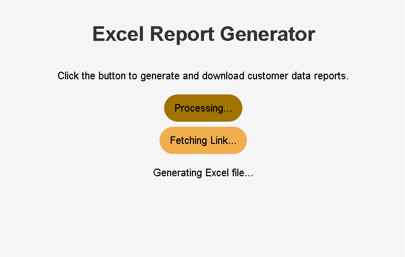
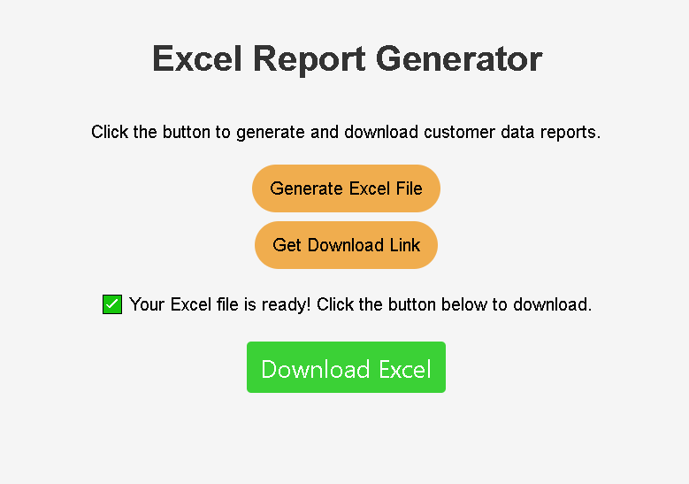

# Customer Data Management Project

This repository contains a full-stack AWS-powered solution for managing customer data and generating Excel reports. The system is divided into two main web applications:

---

## 1. Customer Form Frontend (Hosted on EC2)

This React-based web app allows users to submit customer information, which is securely stored in DynamoDB.

**Features:**
- Form to collect customer data.
- Data is stored in DynamoDB.
- Hosted on an EC2 instance using Docker.

**How to Run:**
[Live Demo](http://54.157.238.221:8080/)

---


## 2. Sales Dashboard (Local App for Excel Reports)

Dashboard allowing the sales representative to generate and download Excel reports from customer data stored in DynamoDB.

**Features:**
- Generate Excel reports via AWS Lambda.
- Download reports from S3.
- Run locally on machine.




---

## AWS Lambda Excel Export Function

The `lambda-excel-export/` folder contains the Python code for generating Excel files from DynamoDB data.

**How to Deploy:**
1. Zip the contents of the `lambda-excel-export/` folder.
2. Upload the zip file to AWS Lambda.

---

## Technologies Used

- **Frontend:** React, Docker, AWS EC2
- **Backend:** AWS Lambda, API Gateway, DynamoDB, S3
- **Infrastructure:** Docker

---

## Project Structure

```
customer-data-management-project/
|
|-- customer-form-frontend/       
|   |-- public/                  
|   |-- src/                      
|   |   |-- App.js               
|   |   |-- App.css           
|   |   |-- index.js       
|   |   \-- index.css             
|   |-- Dockerfile            
|   \-- package.json          
|
|-- sales-dashboard/           
|   |-- public/                  
|   |-- src/                  
|   |   |-- App.js       
|   |   |-- App.css           
|   |   |-- index.js          
|   |   \-- index.css              
|   |-- Dockerfile              
|   \-- package.json        
|
|-- lambda-excel-export/        
|   |-- lambda_function.py        
|   \-- requirements.txt           
```

